# Module 3: Virtual Class (Recommended) Lesson Plan (2 hours)

## Instructor Preparation

### What Are Virtual Class (Recommended) Sessions?

Virtual Class (Recommended) Sessions are held earlier in the week (Mondays/Tuesdays) and are optional for students. The primary goals of Recommended Sessions are:

1. Build community
2. Help students who are struggling with or stuck on the asynchronous work
3. Provide extra context in the learning journey such as remedial practice, career prep, etc.

Virtual Class (Recommended) Sessions are designed to be flexible in many ways, from student attendance requirements to the Instructor Lesson Plans. As you get to know your students, you should adjust the activities you do and organization of the time to best meet their needs. Each session, however, should incorporate an “office hours” component in which you and your supporting instructional staff can assist students with their individual issues (either in group or in 1:1 breakout groups).

### Virtual Class (Recommended) Session Agenda

The following is a recommended agenda for the session. Times are very rough estimates and will depend on how the conversation is going. Feel free to adjust as you get familiar with the class. However, we recommend doing the organized activities before finishing with the “Office Hours” piece so that students who don’t need that extra assistance can hop off. As well, if the “Office Hours” portion runs out before end of class time, it’s okay to end a bit early.

---

## Overview

The goal of this recommended session is to build excitement about the Pandas library.

The final segment of class time will be devoted to dev environment troubleshooting and open Q&A office hours.

## Learning Objectives

At the end of the session, learners will be able to:

* Work comfortably in the JupyterLab IDE.
* Explain the relationship between Python and Pandas.
* Describe the benefits of Pandas over spreadsheets to manipulate data for financial use cases.
* Create DataFrames from CSV files and use basic commands to manipulate them.
* Manipulate data using DataFrame using indexing with `iloc[]` and `loc[]`

---

## Class Activities

## 1. Welcome and Temperature Check


| Activity Time:       0:05 |  Elapsed Time:      0:05  |
|---------------------------|---------------------------|

### Instructor Do: Welcome and Temperature Check (5 mins)

* Welcome students back for week 3 of class.
* Gauge student sentiment about Module 2, especially how they feel their understanding of the software application development process as a whole has improved.
* Stress how understanding and having some first-hand experience with the software development process will add value as they explore employment opportunities in the FinTech industry.
* Let them know that Module 3 is going of focus on Pandas, a powerful Python library designed to work with tabular data, and another skill that will be valuable in the FinTech environment.
* Before they get started with Pandas, the class is going to work through their first whiteboarding activity in order to help them prep for future interviews.

---

## 2. Whiteboarding Exercise

| Activity Time:       0:20 |  Elapsed Time:      0:25  |
|---------------------------|---------------------------|

### Instructor Do: Introducing WhiteBoarding (5 mins)

When possible, we will use the Recommended lesson as an opportunity for students to review and practice technical interview guidelines.

Communicate to the students that the goal of this section is to get them comfortable with the following aspects of problem-solving strageties:

* Verbalize and exercise methods for problem-solving strategies.
* Map out the guidelines on effectively articulating their problem-solving processes.
* Gain experience from practicing these strategies and guidelines.
* Reflect on their shortcomings and devise improvements to the solutions they develop.

Explain to students that they should keep the following  technical interview methodologies in mind as they are working:

* Restate and explain the problem with a concrete example.
* Sketch the solution at a high level (for example, pseudocode).
* Be able to articulate the approach and any assumptions.
* Translate and implement the solution into functional code (if time allows)
* Discuss the solution's shortcomings and corresponding potential improvements.

More than anything, interviewers want to know an interviewee's mindset and ability to solve problems, even if he or she does not have the full answer or solution. Therefore, communication is absolutely key to outperforming in any interview, not just a technical interview.

Slack out the following [Problem Solving Guidelines](Activities/01-Ins_Problem_Solving_Guidelines/Solved/Technical_Interview_Guidelines.md)

Let the students know that they will have 10 minutes to work on the answer to the question that is posed, and then you will discuss possible solutions with the class.

### Student Do: Buy Low Sell High (10 mins)

**Files:**

* [Buy Low Sell High Activity File](Activities/02-Stu_WhiteBoarding/Buy_Low_Sell_High.md)

* Based on the scenario provided, have the students sketch out a possible solution as if this was an interview question.

* They should use the Technical Interview Guidelines as structure for their response.

* Confirm that they are NOT expected to write code. This activity is more conceptual in nature.

### Instructor Do: Review Buy Low Sell High WhiteBoarding Activity (5 mins)

**Files:**

[Discussion Prompts](Activities/02-Stu_WhiteBoarding/Solved/README.md)

* Ask students if any would like to volunteer their potential solution.
* Ask thought-provoking questions based on the Prompts supplied in the Discussion Prompts document.
* Slack out the solution code to the students when the discussion concludes.

[brute_force.py Solution File](Activities/02-Stu_WhiteBoarding/Solved/brute_force.py)

[linear_scan.py Solution File](Activities/02-Stu_WhiteBoarding/Solved/linear_scan.py)

---

## 3. JupyterLab

| Activity Time:       0:10 |  Elapsed Time:      0:35  |
|---------------------------|---------------------------|

### Instructor Do: Introducing JupyterLab (10 mins)

* Introduce the JupyterLab IDE to the students, explaining that it is the IDE they will be utilizing for the remainder of the course.

* Confirm that all students have JupyterLab installed and can access it from their machines.
  * Have the teaching assistants work with any students that cannot access JupyterLab.

* Provide students with a quick tutorial on launching JupyterLab from Terminal/GitBash and give them a quick tutorial on the JupyterLab user-interface
  * Examples include running a file, how cells have to be run in order, clearing cell output, how cells can be added and cut, how cells can be moved up and down, etc.
  * Point out that where Python script files end with a ".py" designation. The designation for a Jupyter Notebook is ".ipynb". Assure students that both are Python files and that both have access to the same functionality and libraries.
  * Highlight that, where Python script files have their output displayed in the command line screen, Jupyter Notebook files display their results right in the Notebook!

Transition to the next topic with a sentiment similar to the following:

> "Pandas takes Python to the next level, and JupyterLab is the best venue in which to explore Pandas. So lets get started!"

---

## 4. Introducing Pandas and the DataFrame


| Activity Time:       0:40 |  Elapsed Time:      1:15  |
|---------------------------|---------------------------|

### Instructor Do: Why Pandas? (5 mins)

Start the discussion on Pandas by highlighting the following points:

* Pandas is a powerful software library designed specifically for data analytics and time series analysis, which are useful features for quantitative analytics.

* Pandas is Python code that a user wrote for the purpose of financial analytics; instead of hoarding their code in the depths of a hard drive, the creators packaged up the functions and made them available to the public.

Highlight the advantages of Pandas over spreadsheets.

* Pandas provides many advantages over spreadsheets due to its data structures and built-in functions for analysis.

* Pandas doesn't require users to memorize formulas. Common financial calculations and formulas are made available to Pandas users as functions.

* Pandas offers functions that ensure data is clean and ready for analytic use.

* Pandas functions range from simple arithmetic to complex statistics. This allows users to automate most, if not all, financial calculations. Instead of writing the formula in a cell or calculating by hand, users just need to make a function call (e.g., `pct_change` to calculate daily returns for an investment). This makes Pandas extremely valuable for developers in the FinTech industry.

* Explain to students that they have already installed Pandas through Anaconda, so they don't need to install it as an additional library.  Demonstrate how students can view their list of avaliable libraries by opening Terminal/Gitbash and typing the following and highlighting Pandas in that list:

``` shell
conda activate dev
conda list
```

### Instructor Do: Reading CSVs and the Pandas Dataframe (5 mins)

Students should have covered this material in their async lesson, but it is worth doing a high-level review so you can confirm that everyone is on the same page.

Financial data is commonly converted from other format (e.g., an Excel file or Google sheet) to CSV so that it can be manipulated by programs like Pandas.

Explain to the students that learning how to read CSV data into Pandas is the first step in getting started with creating automated analytics pipelines.

**Files:**

[reading_csvs.ipynb](Activities/03-Ins_Reading_CSVs/Solved/reading_csvs.ipynb)

[sales.csv](Activities/03-Ins_Reading_CSVs/Resources/sales.csv)

[sales_no_header.csv](Activities/03-Ins_Reading_CSVs/Resources/sales_no_header.csv)

Explain the following point:

* A DataFrame is a special data structure in Pandas that is designed to work with tabular data (data that has rows and columns like a spreadsheet) and provides some useful functions to help analyze and manipulate tabular data.

* A Pandas DataFrame can be created in several ways, such as using a Python dictionary, a list of lists, or reading data from an external file like CSV or JSON.

* Comma-separated values (CSV) is one of the most common file formats used to share data on finance. Students will start working with DataFrames by creating them from CSV files.

* The following documents are are great resources if students want to learn more about creating DataFrames.

  1. [Pandas DataFrame Documentation](https://pandas.pydata.org/pandas-docs/stable/reference/api/pandas.DataFrame.html)

  2. [The Pandas Getting Started Guide](https://pandas.pydata.org/docs/user_guide/10min.html#min)

Start by opening the two CSV files in the [Resources](Activities/03-Ins_Reading_CSVs/Resources) directory, `sales.csv` and `sales_no_header.csv` to show students the format of the data. Point out that one file has a header while the other does not. Refer back to these files during the demo as needed.

Next, open `reading_csvs.ipynb` and walk through the following aspects of the code with your students. Highlight the following in sequential order.

First, emphasize how to import Pandas.

* In order to use Pandas, the `pandas` library must be imported. Pandas is commonly aliased as `pd` at this time.

* The `Path` class is also imported from the [`pathlib` module](https://docs.python.org/3/library/pathlib.html) in order to deal with file paths across all operating systems without complexity.

```python
import pandas as pd
from pathlib import Path
```

Next, discuss the `read_csv` function.

* The `read_csv` function allows users to read a CSV file into a DataFrame.

* The function usually just needs the path to the file, which in this case is defined using the `Path` class.

```python
csvpath = Path("../Resources/sales.csv")
sales_dataframe = pd.read_csv(csvpath)
sales_dataframe.head()
```

Then highlight the `head` function.

* The `head` function shows the first 5 rows of the data by default.

* `head` is a common function used to take a peek at the DataFrame to ensure everything loaded correctly.

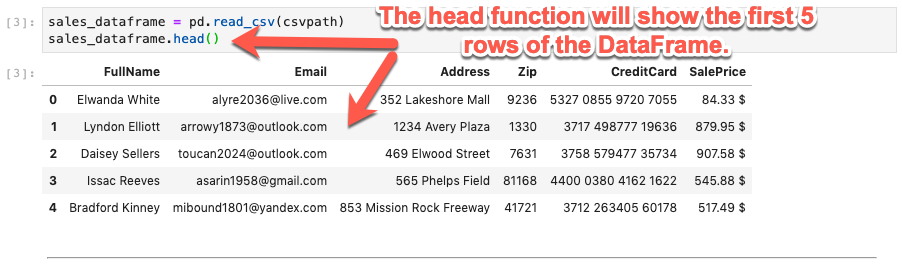

Now call attention to the `header` parameter for `read_csv`.

* The `header=None` parameter tells Pandas not to use the first row as the header. Because no header is specified, the column index numbers are used instead.

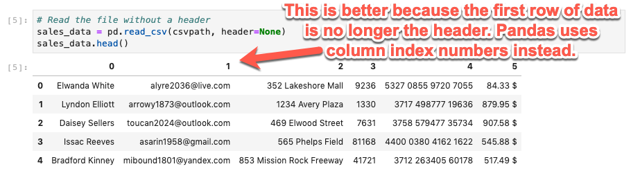

* New headers can be supplied by assigning a new list of column names to the `columns` attribute.

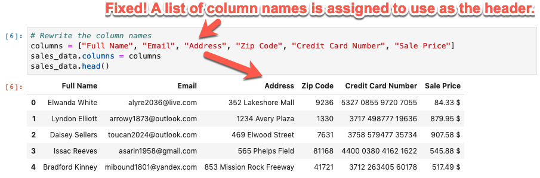

It is common to generate high-level statistics when creating a DataFrame. In this case the Pandas `describe` function can be used.

* The output of the function is summary statistics for numeric fields, including series counts, averages, minimum value, maximum value, and so on.

* The describe function can be especially helpful in very quickly and easily gaining some high-level insights into the dataset.

* A limitation of the `describe` function is that it only calculates summary statistics for numeric values columns.

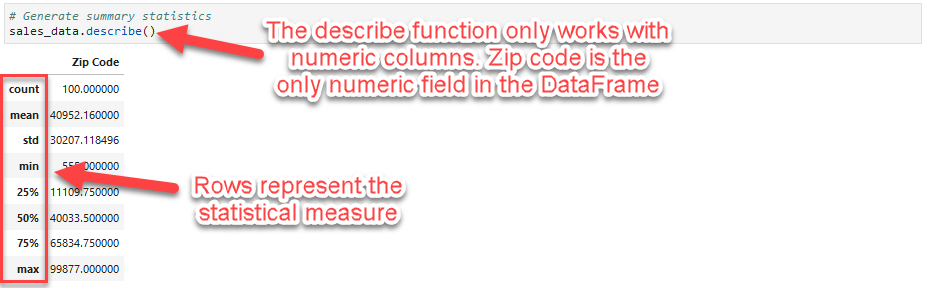

Consult the Pandas documentation to read more about the [read_csv](https://pandas.pydata.org/pandas-docs/stable/reference/api/pandas.read_csv.html) function. Show the many options available in the function signature.

Explain that, while the most common scenario is to simply provide the path to the file, Pandas provides a lot of configuration options for almost any other situation that may arise when reading CSV files --- such as the parameters associated with the file path and header that were used in the demo code.


### Instructor Do: Column Manipulation (10 mins)

It's important that students know how to create and curate DataFrames to fit their needs.

Knowing how to manipulate the columns of a DataFrame is a step in the direction of knowing how to do this.

**File:**

[column_manipulation.ipynb](Activities/04-Ins_Columns/Solved/column_manipulation.ipynb)

Transition to the topic of column manipulation by covering the following talking points:

* Reading CSV data into Pandas is an easy feat, but sometimes the DataFrame's schema/structure needs to change. This includes changing DataFrame column names, adding columns, and dropping columns.

* Now it's time to learn how to use the various Pandas functions to perform each of these operations.

**Slack out the solution file to students to use as a reference and follow along.**

Open the solution file and demonstrate the fundamentals of column manipulation in Pandas:

* Pandas DataFrames have a `columns` attribute that shows the current column names.

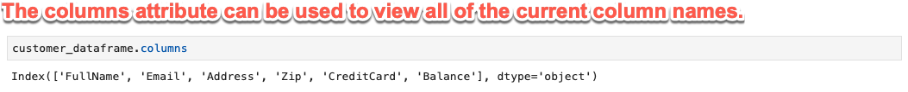

* The `columns` attribute can be assigned a new list of column values. This has certain restrictions, such as that the list of column names must match the number of columns in the DataFrame (no partial lists). This is valuable whenever column names need to be changed.

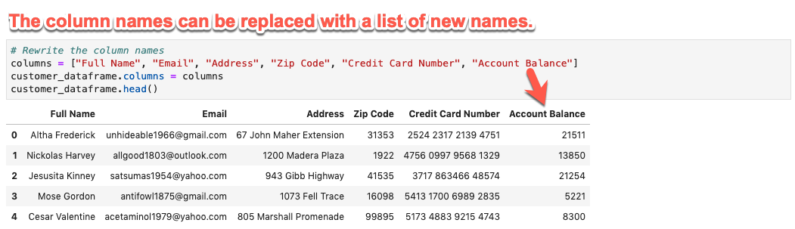

* The `rename` function can be used to replace or update selective column names. Simply provide a dictionary to the column's parameter that has the following format:

```python
{
"Old Column Name": "New Column Name"
}
```

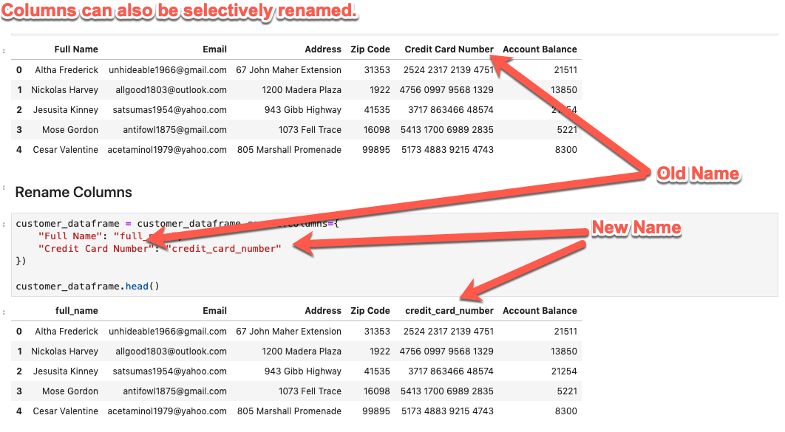

* Columns can also be reordered by supplying a list of columns in the desired order.

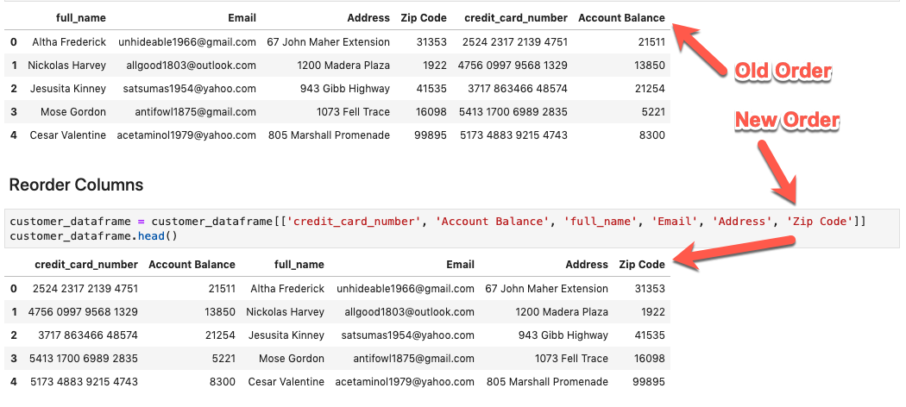

* New columns can be created by assigning a Pandas series to a new column name. This is similar to how dictionaries add values for new keys.

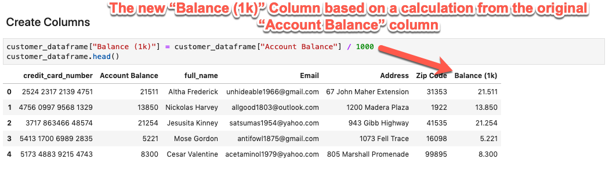

* Sometimes, columns may need to be split into separate values. Pandas allows you to split a column based on a delimiter. In this case, the values are split by the whitespace between the names. The `expand=True` flag tells Pandas to create two new columns from the split. These columns can be assigned to new column names in the DataFrame.

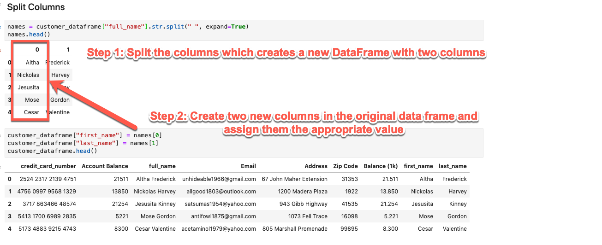

* Columns that are no longer needed can be dropped using the `drop` function. Simply supply a list of the columns that should be dropped from the DataFrame.

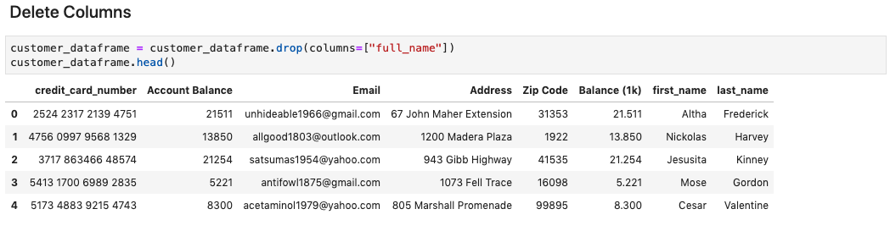

* Finally, students can export the altered datafame as a new CSV file back to the Resources folder.


It is now time for students to try their hand at importing a DataFrame and manipulating the columns.

### Student Do: Manipulating DataFrames (15 mins)

Slack out the solution files for the CSV & Column Manipulation lessons so the students can use them as reference.

**Reference:**

[Reading CSV](Activities/03-Ins_Reading_CSVs/Solved/reading_csvs.ipynb)

[Column Manipulation](Activities/04-Ins_Columns/Solved/column_manipulation.ipynb)

This is an exercise in which students will get hands on experience manipulating the structure of a Pandas DataFrame, namely its columns.

If students appear to be struggling, transition the activity to a 'We Do' in either a breakout room or in the main room depending on the numbers.  We want to use the class to build confidence. Completing this task with them and providing context for the code should help to do that.

The Bonus activity might be a stretch for most students as they are not yet familiar with Numpy. The code they will need has been provided for them, but it will be good for them to get some supported practice with using libraries which with they many be unfamiliar.

**Files:**

[Instructions](Activities/05-Stu_Columns/README.md)

[Starter code](Activities/05-Stu_Columns/Unsolved/columns.ipynb)

[Resources](Activities/05-Stu_Columns/Resources/people.csv)

**Instructions:**

This is an exercise in which you will learn to manipulate the structure of a Pandas DataFrame, namely its columns. Often times, it is necessary to alter the structure of a Pandas DataFrame to fit the needs of the user.

Perform the following steps:

1. Import the `pandas` and `pathlib` libraries.

2. Create a variable `csvpath` that represents the path to the [people.csv](Resources/people.csv) using the Pathlib library.

3. Read the CSV into a Pandas DataFrame using the `csvpath` variable and display a few rows of the DataFrame.

4. View the column names of the Pandas DataFrame.

5. View the column data types of the Pandas DataFrame.

6. Rename the columns of the Pandas DataFrame to "Person_ID", "First_Name", "Last_Name", "Email", "Gender", "University", "Occupation", "Salary".

7. Alternatively, rename the columns of the Pandas DataFrame using a Dictionary.

8. Re-order the columns of the Pandas DataFrame to "Person_ID", "Last_Name", "First_Name", "Gender", "University", "Occupation", "Salary", "Email".


    **Bonus:** Tackle the bonus activity if you finish early.

9. Add the [Numpy](https://numpy.org/) library to your list of imported libraries.[Numpy](https://numpy.org/)

    If you are unfamiliar with the numpy library the typical import  statement reads:

    ```python
    import numpy as np
    ```

10. Create two additional columns: `Age` and `Age_Copy`. Use the `randint` function from the `numpy` library with the `low`, `high`, and `size` parameters set to `22`, `65`, and `1000`, respectively, to randomly generate an integer from 22 to 65 for 1000 rows.

    The numpy code to generate the randome values is as follows:

    ```python
    np.random.randint(low=22, high=65, size=1000)
    ```

11. Delete the newly created `Age_Copy` column.

12. Save the modified DataFrame to a new CSV, and put the file in the `Resources` folder.

### Instructor Do: Review Manipulating DataFrames (10 mins)

In this section, review the previous activity with students knowing that the Bonus will be a stretch for most students.

**Files:**

[Solution code](Activities/05-Stu_Columns/Solved/columns.ipynb)

[Resources](Activities/05-Stu_Columns/Resources/people.csv)

* Importing the CSV file with Path

```python
csvpath = Path("../Resources/people.csv")
```

* Creating and viewing the dataframe with read_csv().

```python
people_df = pd.read_csv(csvpath)
people_df.head()
```

* Viewing column names and types

```python
people_df.columns
people_df.dtypes
```

* Renaming columns using a list and a dictionary

```python
columns = ["Person_ID", "First_Name", "Last_Name", "Email", "Gender", "University", "Occupation", "Salary"]
people_df.columns = columns
people_df.head()
```

```python
people_df = people_df.rename(columns={
    "id": "Person_ID",
    "first_name": "First_Name",
    "last_name": "Last_Name",
    "email": "Email",
    "gender": "Gender",
    "uni_grad": "University",
    "job_title": "Occupation",
    "Income": "Salary"
})

people_df.head()
```

* Reordering Columns

```python
people_df = people_df[["Person_ID", "Last_Name", "First_Name", "Gender", "University", "Occupation", "Salary", "Email"]]
people_df.head()
```

* **Bonus with Numpy** Be sure to cover this information as Numpy might be unfamiliar to some students. Explain the Numpy library is one of the most popular mathematical libraries used in conjunction with Python and Pandas. In this case it will be used to generate 1000 (number of people in the dataframe) random ages between 22 and 65.

```python
import numpy as np

people_df["Age"] = np.random.randint(low=22, high=65, size=1000)
people_df["Age_Copy"] = np.random.randint(low=22, high=65, size=1000)
people_df.head()
```

* Dropping Columns

```python
people_df = people_df.drop(columns=["Age_Copy"])
people_df.head()
```

* Saving the modified dataframe to a new CSV file

```python
people_df.to_csv("../Resources/people_reordered.csv")
```

---

## 5. Break

### Break (5 mins)

Gauge the mood of the room and provide the students a quick break if you think it is needed.

---

## 6. Locating Data in the DataFrame (Indexing)

**Important:**

If the students seem to overwhelmed with either JupyterLab or the Pandas DataFrame, you can take time from this activity to extend the prior activities review or skip this section altogether. There will be a section on Indexing in the Required lesson.

It is important for students to be comfortable with both JupyterLab and manipulating the DataFrame in order to succeed in this Module and beyond.


| Activity Time:       0:30 |  Elapsed Time:      1:45  |
|---------------------------|---------------------------|

### Instructor Do: Indexing (10 mins)

Explain to students that being able to capture specific data points from a large dataset is an essential skill for FinTech analysts.  Datasets can contain overwhelming amounts of information, most of which is probably extraneous to the specific project being worked on. Accessing only the information necessary for the analaysis is a must!

In this part of the lesson, students will learn how to locate and select data within a DataFrame through indexing.

> "Indexing can be thought of as the process of slicing, dicing and generally creating subsets of the available DataFrame. This allows us to set values for any of the cells, or rows, in our table."

**File:**

[indexing.ipynb](Activities/06-Ins_Indexing/Solved/indexing.ipynb)


Open [indexing.ipynb](Activities/06-Ins_Indexing/Solved/indexing.ipynb) and demo the activity, explaining the following:

Engage with the students and have them review what it happening in the first 4 cells. This should help reinforce the information they have learned regarding the Pandas DataFrame.

```python
# Import libraries and dependencies
import pandas as pd
from pathlib import Path

# Set the file path
file_path = Path('../Resources/people.csv')
# Read in the CSV as a DataFrame
people_csv = pd.read_csv(file_path)
people_csv.head()

# View the summary statistics for the DataFrame, the describe() function defaults to only numerical data
people_csv.describe()

# View the summary statistics for the DataFrame, include all columns
people_csv.describe(include='all')
```

* The `iloc[]` function returns row data based on a **numerical index**.

  * Remind students that this is "indexing"; the first row has an index position of `0`.

```python
# Select the first row of the DataFrame
people_csv.iloc[0]
```

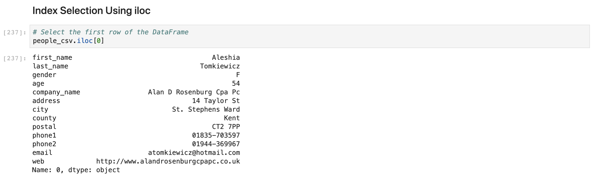

* The `iloc[]` function can return a range of rows based on a numerical index range.

```python
# Select the first 10 rows of the DataFrame
people_csv.iloc[0:10]
```

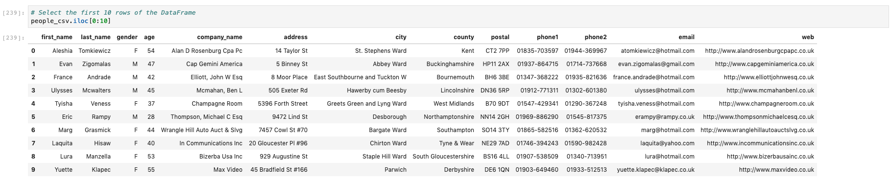

* The `iloc[]` function can return row data of specific columns.

```python
# Select the second column of the DataFrame, with all rows
people_csv.iloc[:,1].head()
```

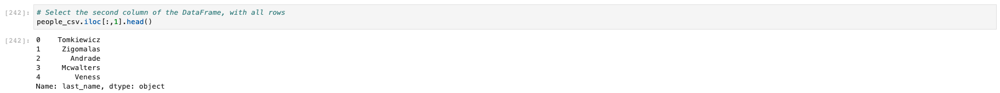

* The `iloc[]` function can return a combination of specific rows and columns.

```python
# Select the first 5 rows of the 3rd, 4th, and 5th columns of the DataFrame
people_csv.iloc[0:5, 2:5]
```

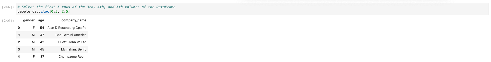

* The `iloc[]` function can be used to modify specific row values.

```python
# Modify the 'first_name' column value of the first row
people_csv.iloc[0, people_csv.columns.get_loc('first_name')] = 'Arya'
people_csv.head()
```

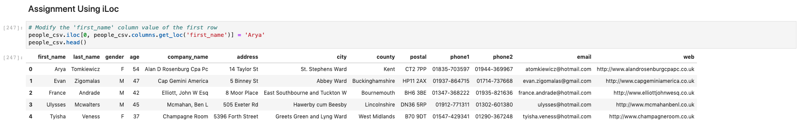

* To use the `loc[]` function on the index of a DataFrame, string values need to be set as the index using the `set_index()` function. Note that `set_index` does not return a new DataFrame but rather creates a copy of the original. Any changes made to the indexed DataFrame will be passed on to the original DataFrame.

```python
# Indexing
people_csv.set_index(people_csv['first_name'])
people_csv.head()
people_csv.copy()
```

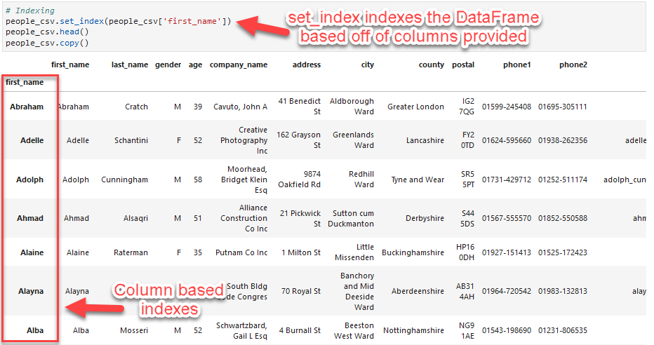

* The `copy` function is used to decouple original DataFrames from DataFrames indexed by `set_index`. This prevents changes made to the indexed DataFrame from being made to the original DataFrame, ensuring that the state of the original DataFrame is preserved. This is Pandas' way of implementing version control on DataFrames.

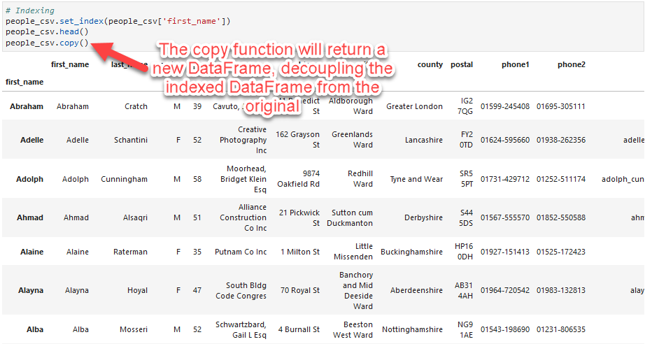

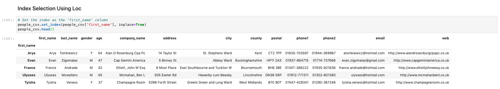


In this next section will we turn our attention from to the Pandas `loc[]` syntax.


* The `loc[]` function returns a row based on a **string index**.

  * stress that `iloc[]` uses the numerical index position where as `loc[]` uses labels from the index.

```python
# Select the row with the index 'Evan'
people_csv.loc['Evan']
```

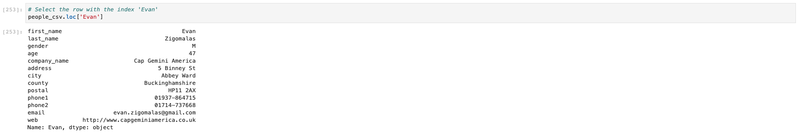

* The `loc[]` function can return a range of rows based on a range of string indexes.

```python
# Slice the data to output a range of rows based on the index
people_csv.loc['Aleshia':'Svetlana'].head()
```

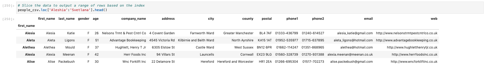

* The `loc[]` function can return rows based on column value conditionals.

```python
# Filter rows based on a column value conditional
people_csv.loc[people_csv['gender'] == 'M'].head()
```

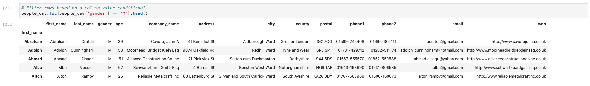

* The `loc[]` function can modify specific row values.

```python
# Modify the 'first_name' value of the row with the index 'Yun'
people_csv.loc['Yun', 'first_name'] = 'Yuna'
people_csv.head()
```

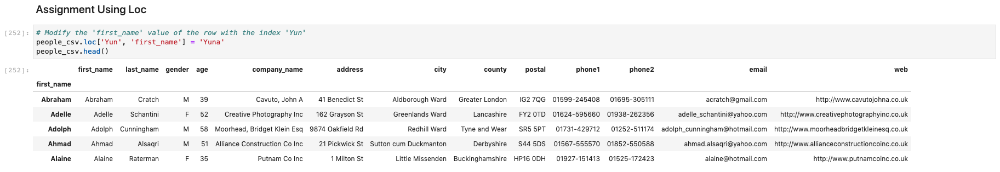

* Explain that it will take some time to get used to indexing data with Pandas; but over time, it will become second nature. Practice makes perfect!

### Student Do: Indexes (15 min)

Slack out the solution file for Indexing so that the students can use it as reference material.

#### Reference

[Instructor Do Solution File](Activities/06-Ins_Indexing/Solved/indexing.ipynb)

In this exercise students will get practice using indexes to select specific portions (via rows and columns) of a Pandas DataFrame.

Let students know that being able to subset data is a requirement to successfully work with Pandas DataFrames, and that the only way to build up this skill is with practice!

If students appear to be struggling, transition the activity to a 'We Do' in either a breakout room or in the main room depending on the numbers.  We want to use the class to build confidence. Completing this task with them and providing context for the code should help to do that.

Slack out the following files to the students.

**Files:**

[Instructions](Activities/07-Stu_Indexes/README.md)

[Starter Code](Activities/07-Stu_Indexes/Unsolved/indexes.ipynb)

[Resources](Activities/07-Stu_Indexes/Resources/people_cleansed.csv)

**Instructions:**

In this exercise you'll learn how to use indexes to select specific portions (via rows and columns) of a Pandas DataFrame.

Perform the following:

1. Import the `pandas` and `pathlib` libraries.

2. Create a variable `csvpath` that represents the path to the [people_cleansed.csv](Resources/people_cleansed.csv) using the Pathlib library.

3. Read the CSV into a Pandas DataFrame and display a few rows.

4. Index Selection with `iloc`:

    1. Select the second row of the DataFrame using `iloc`.

    2. Select the first 5 rows of the DataFrame using `iloc`.

    3. Select the third column using `iloc`.

    4. Select the second to last column using `iloc`.

    5. Select the first five columns using `iloc`.

    6. Select the 2nd, 4th, 6th, and 8th rows of the 1st, 3rd, and 5th columns using `iloc`.

    7. Select the first 5 rows of the 2nd, 3rd, and 4th columns using `iloc`.

    8. Modify the `last_name` column value of the third row using `get_loc` and `iloc`.

5. Index Selection with `loc`:

    1. Set the `First_Name` column as the Pandas DataFrame index.

    2. Sort the DataFrame by the `First_Name` index in descending order.

    3. Select the row with the `First_Name` index "Robert" using `loc`.

    4. Select the rows where `Gender` is equal to 'Female' using `loc`.

    5. Change the `First_Name` value of the rows with 'Zerk' as the `First_Name` index to 'A.A.-Ron'.

### Instructor Review: Indexes (5 min)

Using the solution file, walk the students through any questions they may have regarding the activity.

If possible, use the code below to live-code the solution using the Unsolved file.

**File:**

[Starter Code](Activities/07-Stu_Indexes/Unsolved/indexes.ipynb)

[Solution Code](Activities/07-Stu_Indexes/Solved/indexes.ipynb)

1. Import the `pandas` and `pathlib` libraries.

    ```python
    # Import libraries and dependencies
    import pandas as pd
    from pathlib import Path
    ```

2. Create a variable `csvpath` that represents the path to the [people_cleansed.csv](Resources/people_cleansed.csv) using the Pathlib library.

    ```python
    # Use the Pathlib library to set the path to the CSV
    csv_path = Path('../Resources/people_cleansed.csv')
    ```

3. Read the CSV into a Pandas DataFrame and display a few rows.

    ```python
    # Read in the CSV as a DataFrame
    people_csv = pd.read_csv(csv_path)
    people_csv.head()
    ```

4. Index Selection with `iloc`:

    * Select the first row of the DataFrame using `iloc`. Remind the students that `indexing` means that the count starts with 0.

    ```python
    # Select the second row of the DataFrame
    people_csv.iloc[1]
    ```

      * Select the first 5 rows of the DataFrame using `iloc`.

    ```python
    # Select the first 5 rows of the DataFrame
    people_csv.iloc[0:5]
    ```

      * Select the third column using `iloc`. Remind the students that `indexing` means that the count starts with 0.

    ```python
    # Select the second column of the DataFrame
    people_csv.iloc[:,2].head()
    ```

      * Select the second to last column using `iloc`.

    ```python
    # Select the second to last column of the DataFrame, with all rows
    people_csv.iloc[:,-2].head()
    ```

      * Select the first five columns using `iloc`.

    ```python
    # Select the first five columns of the DataFrame, with all rows
    people_csv.iloc[:, 0:5].head()
    ```

      * Select the 2nd, 4th, 6th, and 8th rows of the 1st, 3rd, and 5th columns using `iloc`.

    ```python
    # Select the 2nd, 4th, 6th, and 8th rows of the 1st, 3rd, and 5th columns.
    people_csv.iloc[[1,3,5,7], [0,2,4]]
    ```

      * Select the first 5 rows of the 2nd, 3rd, and 4th columns using `iloc`.

    ```python
    # Select the first 5 rows of the 2nd, 3rd, and 4th columns using `iloc`.
    people_csv.iloc[0:5, 1:4]
    ```

      * Modify the `Last_Name` column value of the third row using `get_loc` and `iloc`.

    ```python
    # Modify the 'Last_Name' column value of the third row
    people_csv.iloc[2, people_csv.columns.get_loc('Last_Name')] = 'Arya'
    people_csv.head()
    ```

5. Index Selection with `loc`:

    * Set the `First_Name` column as the Pandas DataFrame index.

    ```python
    # Set the index as the 'First_Name' column
    people_csv = people_csv.set_index(people_csv['First_Name'])
    people_csv.head()
    ```

      * Sort the DataFrame by the `First_Name` index in descending order.

    ```python
    # Sort the index
    people_csv = people_csv.sort_index(ascending=False)
    people_csv
    ```

      * Select the row with the `First_Name` index "Robert" using `loc`.

    ```python
    # Select the rows with the index 'Robert'
    people_csv.loc['Robert']
    ```

      *  Select the rows where `Gender` is equal to 'Female' using `loc`.

    ```python
    # Select the rows where `Gender` is equal to 'Female' using `loc`.
    people_csv.loc[people_csv['Gender'] == 'Female'].head()
    ```

      * Change the `First_Name` value of the rows with 'Zerk' as the `First_Name` index to 'A.A.-Ron'.

    ```python
    # Change the `First_Name` value of the rows with 'Zerk' as the `First_Name` index to 'A.A.-Ron'
    people_csv.loc['Aaron', 'First_Name'] = 'A.A.-Ron'
    people_csv.head()
    ```

    Congratulate the students on working through a challenging activity on an very big day. Pandas and DataFrames are two important aspects of data analysis in the FinTech world and this knowledge will serve them well.

    At this point, transition into the Q&A portion of the lesson.

---

## Q&A

| Estimated time: Until the end of class|
|---------------------------------------|

### Instructor Do: Q&A

This is an opportunity to support students in any way that they require.

* Ask students if they have any questions about working with JupyterLab.
* Ask the students if they have any questions about the material covered in today's live lesson.
* Ask students if they have any questions about the material covered in the async content.
* Review the Challenge Lesson with the students and remind them that their Challenge Lesson is due on Sunday evening.

---

© 2020 Trilogy Education Services, a 2U, Inc. brand. All Rights Reserved.
